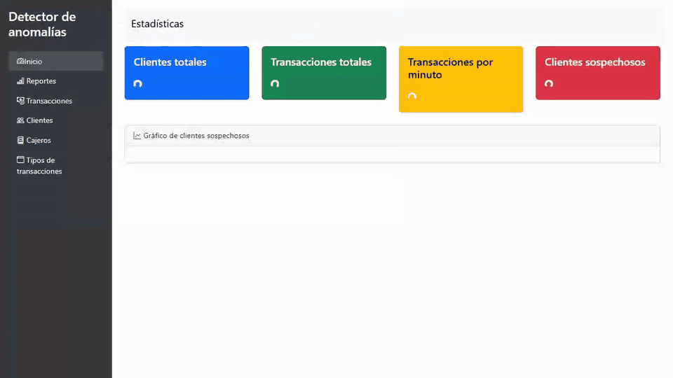

# Detector de anomalías en transacciones bancarias (front)

Panel web de un detector de clientes sospechosos sobre transacciones de cajeros automáticos. Es el trabajo práctico (TP) de la materia Base de Datos de la Tecnicatura en Programación Informática (UNSAM, 2025), que hicimos en un equipo de seis personas. Este repositorio es el front; la API, la base de datos y los modelos de detección están en [transacciones-db-api](https://github.com/solalcaraz/transacciones-db-api), donde también está explicado cómo funciona la detección.

## Problema que resuelve

La API devuelve clientes sospechosos, scores y motivos en JSON, que no le sirven a alguien que tiene que revisar alertas. El front muestra esos resultados en un dashboard con indicadores y un gráfico, un reporte de clientes sospechosos con el motivo de cada alerta y el detalle de las transacciones de cada cliente, con las anómalas resaltadas. También permite consultar y editar clientes, cajeros y transacciones.

El desafío técnico fue el volumen en el navegador: son 173.242 transacciones y 8.819 clientes, y la API pagina los resultados pero no tiene un endpoint de búsqueda.

## Demo



El recorrido pasa por el dashboard, el reporte de sospechosos, el detalle de un cliente con dos transacciones marcadas y las tablas de transacciones y clientes. Las esperas de carga están aceleradas en el GIF, porque la API entrena los modelos en cada pedido.

## Tecnologías

- HTML y JavaScript sin frameworks.
- Bootstrap 5 y Bootstrap Icons.
- Plotly, para el gráfico que genera la API.

## Cómo funciona

Cada pantalla es un HTML que consulta la API con `fetch`:

| Página | Qué muestra |
|---|---|
| `index.html` | Totales, porcentaje de clientes sospechosos y el gráfico de dispersión de clientes |
| `reportes.html` | Los clientes sospechosos con sus motivos, con búsqueda y paginación |
| `transacciones_cliente.html` | Las transacciones de un cliente, con las sospechosas en rojo y su score |
| `clientes.html`, `cajeros.html`, `transacciones.html`, `tipos_transacciones.html` | Tablas con búsqueda; en clientes y cajeros, también alta, edición o baja |

En el equipo decidimos que cada tabla trajera todos los registros en un solo pedido (primero consulta el total en `/count`) y que la búsqueda y la paginación se hicieran en memoria, porque la API no busca. El gráfico llega de la API como HTML de Plotly; como `innerHTML` no ejecuta los `<script>` que trae, `dashboard.js` los vuelve a crear para que el gráfico se dibuje.

Las decisiones que tomé y por qué:

- **Juntar el código repetido en `comun.js`, `tabla.js` y `menu.js`.** La tabla con búsqueda y paginación estaba copiada igual en cajeros, clientes y transacciones, funciones como `escapeHtml` o `showError` estaban en casi todas las páginas y el menú lateral se repetía en las siete. Ahora cada página solo define sus columnas y sus acciones.
- **Dejar aparte la paginación de reportes.** Tiene otro diseño (botones Anterior y Siguiente, 10 por página), y unificarla habría cambiado la interfaz.
- **Seguir sin build ni módulos.** Los scripts se cargan con `<script>` comunes, como antes, así que el front sigue funcionando con cualquier servidor estático.

## Cómo correrlo

Con la [API](https://github.com/solalcaraz/transacciones-db-api#cómo-correrlo) corriendo, alcanza con servir esta carpeta en el puerto 5500 y abrir http://127.0.0.1:5500:

```bash
python -m http.server 5500
```

Si la API corre en otra dirección, se cambia en `config.js`.

## Qué aprendí y qué mejoraría

**Qué aprendí**

- A decidir qué unificar mirando el código y no el nombre de las funciones: la paginación de cajeros, clientes y transacciones era idéntica y pasó a `tabla.js`; la de reportes se parecía pero se comportaba distinto, así que quedó en su página.
- A comparar el antes y el después de un refactor de interfaz sin tests: recorrí cada página con Playwright con el código original y con el nuevo, y comparé el texto que aparecía en pantalla.

**Qué mejoraría**

- **No traer todas las transacciones de una vez.** La tabla de transacciones descarga unos 26 MB de JSON al abrirse. Con un endpoint de búsqueda en la API, el front podría pedir solo la página que muestra.

## Autoría y mejoras

Este repositorio es un fork de **[IlledNacu/frontend-transacciones](https://github.com/IlledNacu/frontend-transacciones)**, el trabajo práctico que hicimos en equipo entre septiembre y noviembre de 2025. El tag [`tp-original-2025`](https://github.com/solalcaraz/frontend-transacciones/tree/tp-original-2025) marca el TP tal como lo entregamos. El backend tiene su propio fork: [solalcaraz/transacciones-db-api](https://github.com/solalcaraz/transacciones-db-api).

**Equipo:** María Sol Alcaraz, Illed Nacucchio, Damián Palomba, Lorenzo Graizzaro, Luis Mazo y Santiago Rodríguez Spina.

**Mi parte en la versión original**:

- Participé en la definición de la idea del proyecto y en la limpieza del dataset.
- Armé consultas de la API (endpoints) junto con otros dos compañeros.
- Hice el gráfico de dispersión de clientes sospechosos del dashboard: ubica a cada cliente según su monto promedio y el tiempo entre sus transacciones, y usa Isolation Forest para resaltar a los que se salen de lo común.
- Hice las pantallas paginadas de clientes y de cajeros, y la de tipos de transacción.
- Hice las correcciones finales para que se mostraran todas las transacciones y todos los clientes: las listas quedaban cortadas y no se veía el total.

**Lo que hice después en este fork**:

- Corregí los errores que encontré al usarlo:
  - Si fallaban las estadísticas, el dashboard escribía en un elemento que no existía, una tarjeta quedaba con el spinner y el gráfico no se cargaba.
  - Cuando la API no respondía, las páginas mostraban datos de ejemplo inventados (cajeros en Madrid, clientes "Juan Pérez"); ahora muestran un mensaje de error.
  - La pantalla de cajeros no leía bien el total de `/count` y pedía siempre 1000 registros.
  - La pantalla de tipos de transacción mostraba un botón de paginación "1" sin función.
- Junté el código repetido en `comun.js`, `tabla.js` y `menu.js`, y renombré `main.js` a `dashboard.js`, que era lo único que contenía.
- Pasé la URL de la API a `config.js`, para cambiarla en un solo lugar.
- Reemplacé el CSS copiado en cada página por `styles.css` y eliminé las clases que no se usaban.
- Eliminé el código comentado y los comentarios que solo repetían el código.
- Grabé la demo y reescribí este README.

Para comprobar que el comportamiento no cambió, recorrí cada página con Playwright con el código original y con el nuevo (carga, búsqueda, paginación, detalle de cliente, altas y edición) y comparé el texto que se ve en pantalla: es idéntico, salvo el botón de paginación de tipos que saqué. También probé cada página con la API apagada.
